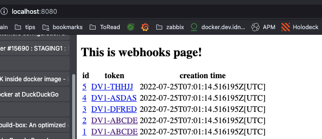

# de.idnow.webhook.site 

This is simple webhook.site, where we can send webhook and later check the payload.

## Running the application in dev mode

You can run your application in dev mode that enables live coding using:
```shell script
./mvnw compile quarkus:dev
```
And after please open: http://localhost:8080/



# Webhooks are stored in In-Memory DB (we delete after 7 days or when service will be restarted)

# Tools:

* maven
* jdk17

# API Overview

## here we can send and save webhooks
```
/webhook/save/{token}
```

## here we can send and save webhooks and response will be given `status_code`
```
/webhook/save/{token}/response/{status_code}
```

## here we can see webhook for given id
```
/webhook/id/{id}
```

## here we can see webhooks for given hash
```
/webhook/hash/{token}
```
